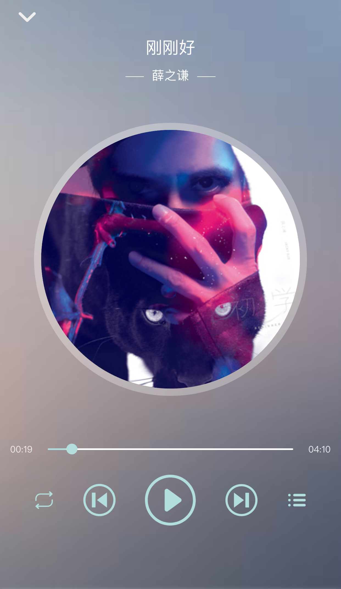
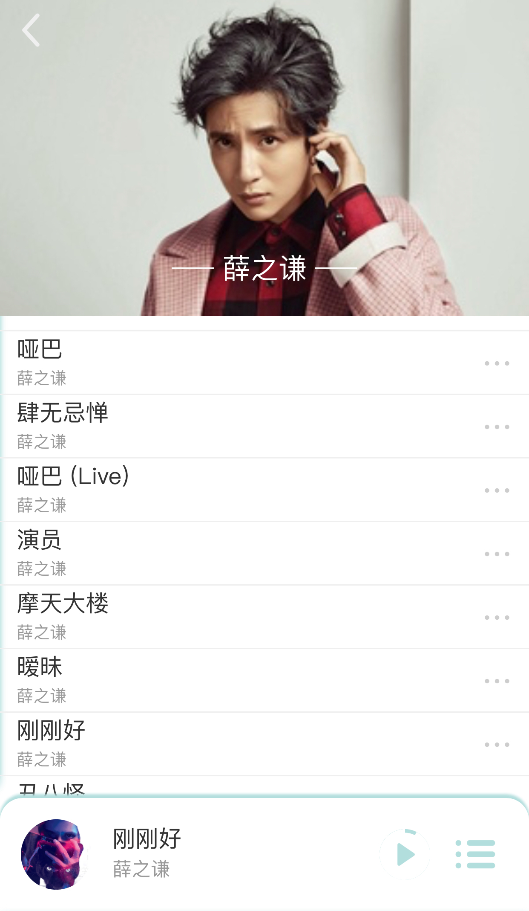

> #### 音悦 ~ 一款PWA版的在线音乐APP

##### 前言

从2017年暑假到现在, 想想自己自学前端也快接近一年了。最大的感受就是前端的技术真的是变化太快，入了前端的坑后, 自己陷的越深, 越是发觉自己要学的东西越多。也是因为这段时间感觉自己的知识积累到了一定的程度, 所以两周前便有了做一个正经的项目的念头。恰好PWA相关的技术在18年特别的火, 自己也很感兴趣, 所以在项目中用到了其中的一部分技术, 还有很多东西因为项目本身的原因并没有继续深入学习且进行实践, 像消息推送和Web分享API啥的... 然后就是自己Node也会了一点皮毛, 于是就有了现在的这款PWA版的在线音乐播放器。首先说明一下, 本人只是一个前端小白, 这一年中像三大框架自己还没有真正开始学习 ( 自己还是太菜了 ... ), 用jq又感觉太没意思, 而且自己还不熟练... 所以前端部分没有用框架写, 全部是基于原生JavaScript的。

emmm, 感觉废话有点多了, 怕看文章的人着急, 所以就先上项目的演示地址和预览图吧吧。对了项目本身是适配移动端的所以网站中打开请切换到移动端视角...

##### 项目演示地址：[音悦 ~ Version Of Progressive Web App](https://cosmos-alien.com:443)

既然说到这里了还是列举一下本项目用到的技术栈吧......

##### 技术栈

* 原生JavaScript
* CSS (3) 、Sass
* Koa2 、axios
* PWA：Manifest、Service Worker 、cacheStorage

##### 已实现的功能

后端部分: 

* 用Koa2搭建的一个服务器, 用来提供路由和处理请求, 然后就是有一个很基本的架构。

* 为前端提供用户请求音乐相关数据的接口, 其实是简单的用axios请求音乐数据然后对其进行必要的过滤之后再返回给前端。在这里提一下音乐的数据多亏了一位学长的指点, 然后自己在QQ音乐官网耐心找一找就有啦 ^_^

前端部分: 

* 基于rem和vw的移动端适配, 自己还用了Sass和Autoprefixer

* 基于CSS3和部分JS配合实现的一些页面动态效果
* 音乐播放器的基本功能
  * 上下首切换
  * 播放顺序的改变
  * 添加歌曲到歌单, 歌单播放, 歌单歌曲删除
* 歌曲、歌手的搜索功能
* 歌手页数据的请求, 每个歌手只有30首歌曲可以播放, 因为QQ音乐给的接口只有30首哈哈 ^_^

PWA部分: 

* 基于Manifest, 实现应用可添加到桌面等功能, 自己用的是IOS系统, 而苹果好像暂时不支持manifest，但有兼容的解决办法。
* 基于Service Worker, 实现静态资源的预缓存, 拦截请求并对其进行处理, 比如图片和音乐可以通过拦截然后进行缓存, 这样在离线的情况下仍能够播放音乐, 可惜的是自己尝试了多次还是有问题, 总感觉是 IOS 11.3.1 上的bug... 因为自己在谷歌浏览器上尝试的时候离线时音乐是可以播放的。所以最终的决定是不缓存音乐。
* 基于cacheStorage, 它是与Service Worker一起使用的一个API，但与localStorage和SessionStorage不同, 因为当用户退出页面后, 放在它里面的缓存数据仍然有效。利用这个特性我实现了保存用户歌单的简单功能, 意思是每次用户退出然后再次进入时, 歌单里面的歌曲仍然存在而不会初始化, 当前显示的歌曲仍和用户退出时显示的歌曲一致。

##### 结语

由于是第一次自己尝试着做正经一点的项目, 自己也是费了很多心思去做, 无论是从界面设计还是到逻辑实现上, 虽然效果和功能都很简陋, 还请谅解 ...... (ㄒoㄒ）如果喜欢的话随手给个Star就十分感谢了 ^_^

项目源码地址：https://github.com/RetroAstro/yinyue

